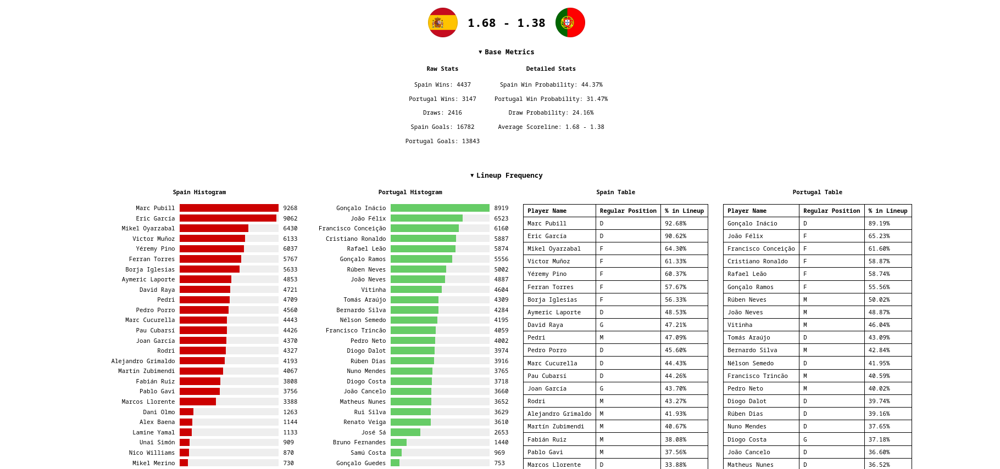
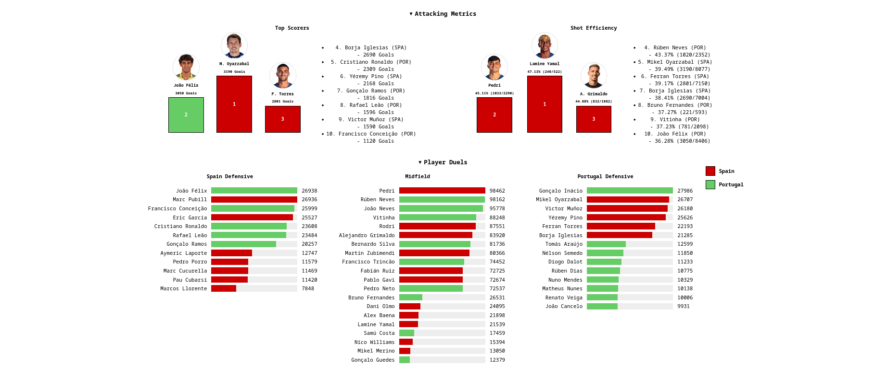
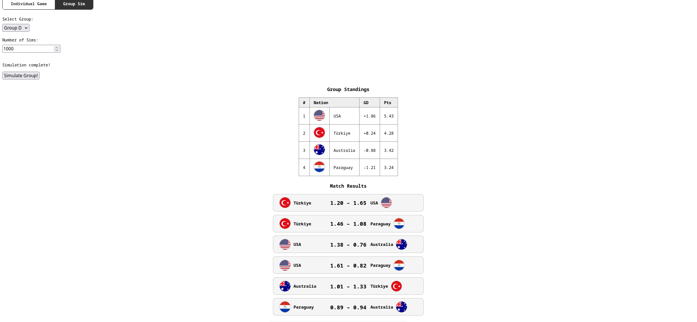

# World Cup Match Simulator

An event-based, Monte Carlo simulation engine for international soccer matches, built around the 2026 World Cup. Simulate individual matchups or entire group stages, with results visualized through win probability charts, duel breakdowns, and standings tables.





---

## How It Works

Each simulation runs an event-based match engine. Rather than simulating a score directly, the engine plays through match events (duels, chances, goals) driven by player attributes. Running thousands of simulations produces a probability distribution over scorelines and outcomes.

Player attributes are derived from real club-level season statistics scraped from a live data source and normalized into 0–100 percentile scores using SciPy. This means stronger real-world performers produce stronger simulation results.

---

## Features

- **Match simulation** — run 10,000+ simulations for any two of the 48 World Cup nations
- **Group stage simulation** — simulate a full group and get averaged standings and scorelines
- **Custom lineups** — pick your own starting XI and run it against any opponent
- **Post-match metrics** — duel win rates by zone, top scorers, lineup breakdowns
- **Player database** — 1,000+ players across 48 nations with percentile-based attributes

---

## Tech Stack

| Layer | Tech | Role |
|---|---|---|
| Simulation engine | Python | Event-based match logic |
| Data pipeline | Python, SciPy, Pandas | Stat scraping + percentile normalization |
| API | FastAPI | REST backend serving sim results |
| Frontend | Vanilla JS / HTML | Interactive UI and visualizations |

---

## Setup

**Requirements:** Python 3.10+

**Install dependencies:**
```bash
pip install -r requirements.txt
```

**Run:**
```bash
uv run python -m uvicorn api.main:app --reload --port 8000
```

Then open `public/index.html` in your browser (or serve it with Live Server).

---

## Player Database

Player attributes are built from a custom data pipeline:

1. Club-level season stats are collected for each international squad
2. Raw stats (passing, dribbling, shooting, etc.) are normalized into percentile scores using `scipy.stats`
3. Players with low minutes are flagged and weighted accordingly

Example player entry:
```json
{
  "position": "F",
  "detailed_positions": ["ST"],
  "ofm": {
    "shooting": 42,
    "dribbling": 47,
    "positioning": 54,
    "aerial": 55,
    "passing": 79
  }
}
```

---

## Nations Included

All 48 nations from the 2026 World Cup group stage, including Spain, England, USA, Mexico, Ecuador, South Africa, and more.
